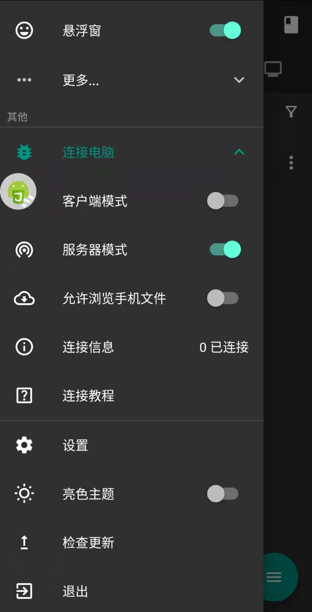
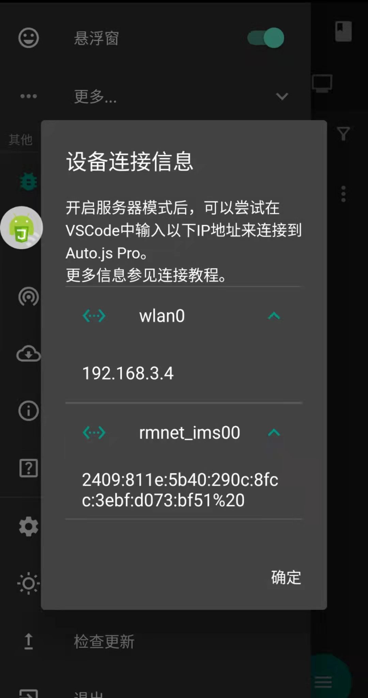
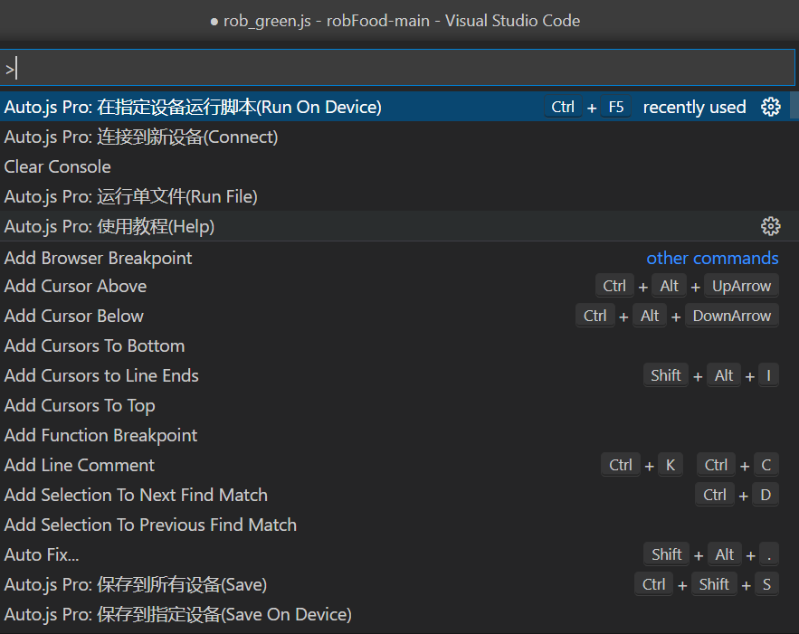

# Rob_greens
本项目纯属学习，基于[robFood](https://github.com/sean529/robFood)进行延伸补充，  
利用[Auto.Js](https://github.com/hyb1996/Auto.js?files=1)框架对安卓手机控件进行操作，    
仅支持安卓手机（因为Auto.js的依赖）。  
另外：Auto.Js现已只支持Auto.js-Pro，原先已经不能使用，需要注册后付费购买。  
[学习工具文档](https://pro.autojs.org/docs/#/zh-cn/?id=%e7%bb%bc%e8%bf%b0)

## 使用

### 电脑端准备。
1.下载 vscode 编辑器，几十M比较小。  
2.进入插件栏，安装 vscode 插件 Auto.js-Pro-Ext。  
3.安装项目依赖，安装node.js（你可能会看到说安装npm,npm是功能包的管理器，会自动安装好）。  
### 手机端准备。
1.手机上安装AutoJsPro（应用市场应该可以找到）。      
2.打开AutoJsPro，打开无障碍服务（下拉开通一个权限）。    
3.连接准备：客户端模式和服务器模式都打开（手机和电脑连接相同的 wifi，处于同样的局域内网才能连接）    
   
### 电脑端和手机端连接。  
1.电脑端输入Ctrl+Shift+P,选择连接新设备,输入目标手机的IP。  
  （windows电脑端在命令行输入ipconfig后IPV4地址就是内网地址，手机端软件中开启服务器模式后可以看到自己内网IP） 
      
2.确认电脑端和手机端都显示连接成功。  
### 运行Or调试。 
   vscode在当前项目文件中继续Ctrl+Shift+P，选择在已经连接的设备运行当前脚本。
     

> 如果对你有帮助请给个 **star** 支持，谢谢，欢迎交流~
